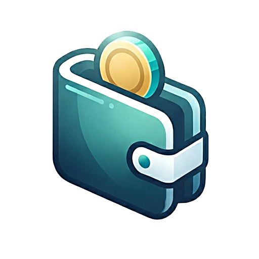

# SuMal - MoneyManager

A public, fast money manager for tracking **income, expenses and savings**. Built as a mobile-first web app and wrapped in an Android APK via Capacitor. Your data is encrypted and stored in **your own Google Drive** — not on any third-party server.

  <a href="https://aungthumyint.github.io/SuMal">&nbsp; <b>Landing Page</b></a>
  &nbsp; &nbsp; &nbsp;
  <a href="https://sumal.vercel.app">&nbsp; <b>Web App</b></a>
  &nbsp; &nbsp; &nbsp;
  <a href="https://github.com/AungThuMyint/SuMal/releases/latest">&nbsp; <b>Android APK</b></a>

## Application Features

- **Transactions** — income, expense and saving entries with an in-app calculator and expression input
- **Categories** — fully customisable, 139 icons across 16 groups plus 14 theme-aware colours
- **Budgets** — monthly limits per category with live progress tracking
- **Savings** — term-based savings plans with precise interest calculation
- **Reports** — date-range summaries and CSV export
- **History** — day-grouped timeline with search, filters and inline edit/delete
- **Encryption** — your backup is encrypted before it ever leaves your device
- **Dark & Light** — automatic themes with careful contrast for both

## What Makes SuMal Different

- **Precise savings calculation** — term-based savings plans with exact interest, not just a simple running total
- **Your data, your Drive** — every backup is stored encrypted in your own Google Drive; no third-party server, no tracking, no lock-in
- **Privacy-first encryption** — data is encrypted (AES-256-GCM + PBKDF2) before it ever leaves your device
- **Expression calculator** — type math like `(25000*3)+15000` directly when logging a transaction
- **Deep customisation** — 139 icons across 16 groups and 14 theme-aware colours
- **Offline & installable** — works as a web app and installs as a native Android APK

## Use Cases

- **Personal budgeting** — plan monthly budgets and see spending against limits at a glance
- **Savings planning** — model term-based savings with interest to reach a goal on time
- **Expense tracking** — log everyday income and expenses in seconds with the calculator
- **Privacy-first users** — keep financial data in your own Google Drive, never on a third-party server
- **Small business** — track cash flow, export CSV reports and review period summaries
- **Offline-friendly** — works as a web app and installs as a native Android APK

## Supported Platforms

| Platform | Description |
| -------- | ----------- |
| Android  | Native APK built with Capacitor |
| Web / PWA| Installable web app hosted on Vercel |

## Built With

| Layer     | Technology                          |
| --------- | ----------------------------------- |
| UI        | React 19 + TypeScript               |
| Styling   | Tailwind CSS v4                     |
| Build     | Vite 8                              |
| Native    | Capacitor 8 (Android)               |
| Sync      | Google Drive API (Google OAuth)     |
| Storage   | AES-256-GCM encrypted, PBKDF2 key derivation |
| Hosting   | Vercel                              |

## SuMal

Developed by Aung Thu Myint © 2026
