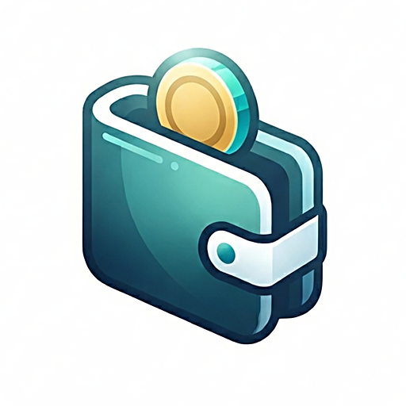

A private, fast money manager for tracking income, expenses and savings. Your data is encrypted and stored only in your own Google Drive.

Landing Page : https://aungthumyint.github.io/SuMal

Web App : https://sumal.vercel.app

Android APK : download from [Releases](https://github.com/AungThuMyint/SuMal/releases/latest)

## Application Features

- **Transactions** — income, expense and saving entries with an in-app calculator and expression input
- **Categories** — fully customisable, 139 icons across 16 groups plus 14 theme-aware colours
- **Budgets** — monthly limits per category with live progress tracking
- **Savings** — term-based savings plans with precise interest calculation
- **Reports** — date-range summaries and CSV export
- **History** — day-grouped timeline with search, filters and inline edit/delete
- **Encryption** — your backup is encrypted before it ever leaves your device
- **Dark & Light** — automatic themes with careful contrast for both

## Use Cases

- **Personal budgeting** — plan monthly budgets and see spending against limits at a glance
- **Savings planning** — model term-based savings with interest to reach a goal on time
- **Expense tracking** — log everyday income and expenses in seconds with the calculator
- **Privacy-first users** — keep financial data in your own Google Drive, never on a third-party server
- **Small business** — track cash flow, export CSV reports and review period summaries
- **Offline-friendly** — works as a web app and installs as a native Android APK

## Supported Platforms

| Platform | Description |
| -------- | ----------- |
| Android  | Native APK built with Capacitor |
| Web / PWA| Installable web app hosted on Vercel |

## Built With

| Layer     | Technology                          |
| --------- | ----------------------------------- |
| UI        | React 19 + TypeScript               |
| Styling   | Tailwind CSS v4                     |
| Build     | Vite 8                              |
| Native    | Capacitor 8 (Android)               |
| Sync      | Google Drive API (Google OAuth)     |
| Storage   | AES-256-GCM encrypted, PBKDF2 key derivation |
| Hosting   | Vercel                              |

Developed by Aung Thu Myint © 2026
